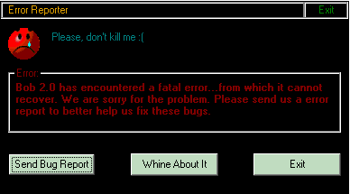



## Error Report & Feedback

### Description

This code will simply tell the user that an error has happened, and will let them mail the user or exit after the error has happened, I myself place this in my Form_Terminate section. This could be easily updated to work with a error trapper code of some kind, I take no credit for the e-mail program, it was created by someone else on PSC and many thanks to them. Also, on another note, please change the e-mail address to your own or something else, from mine, or that or send me feedback from the program :)

My first post, please vote if you like, hating me and closing your browser and stomping bunnies if you hate it...
 
### More Info
 
Creates a INI file with the program version and app path.

             |
---                |---
**Submitted On**   |2000-12-13 18:28:50
**By**             |[Maxwolf](https://github.com/Planet-Source-Code/PSCIndex/blob/master/ByAuthor/maxwolf.md)
**Level**          |Intermediate
**User Rating**    |4.4 (31 globes from 7 users)
**Compatibility**  |VB 4\.0 \(32\-bit\), VB 5\.0, VB 6\.0
**Category**       |[VB function enhancement](https://github.com/Planet-Source-Code/PSCIndex/blob/master/ByCategory/vb-function-enhancement__1-25.md)
**World**          |[Visual Basic](https://github.com/Planet-Source-Code/PSCIndex/blob/master/ByWorld/visual-basic.md)
**Archive File**   |[CODE\_UPLOAD1266712132000\.zip](https://github.com/Planet-Source-Code/maxwolf-error-report-feedback__1-13578/archive/master.zip)

